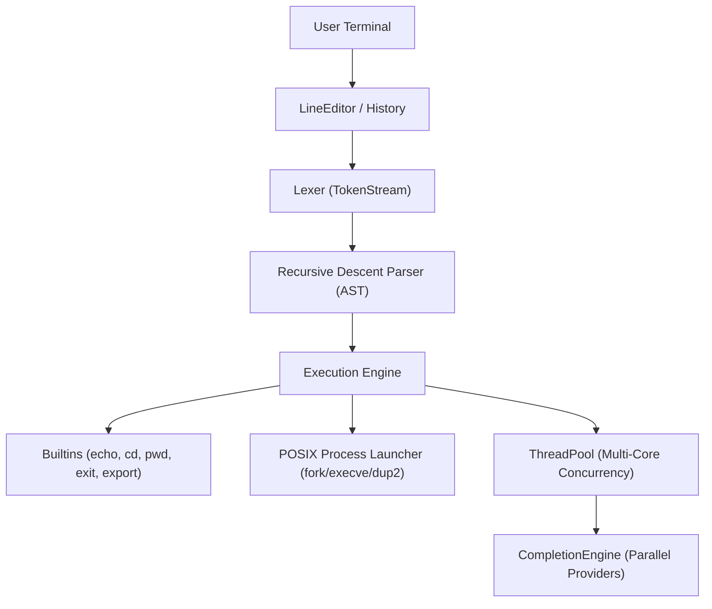

# MyShell — Production-Grade C++20 Unix/POSIX Shell

[](https://en.wikipedia.org/wiki/C%2B%2B20)
[](https://cmake.org)
[](https://clang.llvm.org/docs/AddressSanitizer.html)
[](LICENSE)

**MyShell** is an enterprise-grade POSIX-compatible interactive shell and scripting engine engineered in modern C++20. Designed from first principles for correctness, RAII safety, observability, and measurable multi-core parallelism.

---

## Key Highlights

- **Modern C++20 Architecture**: Value semantics, `Result<T, E>` algebraic error handling, `std::span`, `std::string_view`, `std::jthread`, `std::stop_token`.
- **Parallel Multi-Source Completion**: Concurrently queries filesystem paths, environment variables, builtins, and binary paths via a worker thread pool, merging results deterministically.
- **Robust POSIX Process Execution**: Pipeline orchestration, file descriptor duplication, process status resolution, and multi-stage stream redirection.
- **Job Control & Line Editing**: Terminal capability handling, prompt templating (`\u`, `\h`, `\w`, ANSI colors), bounded command history with persistence.
- **Sanitizer Clean**: Thoroughly validated and verified against AddressSanitizer (ASan), UndefinedBehaviorSanitizer (UBSan), and ThreadSanitizer (TSan).

---

## Quick Start

### Prerequisites
- Linux / POSIX system (x86-64)
- GCC >= 12 or Clang >= 15 (supporting C++20)
- CMake >= 3.25 & Ninja

### Building & Running
```bash
# 1. Configure and build Debug preset
cmake --preset debug
cmake --build --preset debug

# 2. Run test suite
ctest --preset debug --output-on-failure

# 3. Launch interactive shell
./build/debug/src/myshell
```

### Running Sanitizer Suites
```bash
# ASan + UBSan
cmake --preset asan && cmake --build --preset asan && ctest --preset asan

# ThreadSanitizer (TSan)
cmake --preset tsan && cmake --build --preset tsan && ctest --preset tsan
```

---

## Architecture Overview



See [docs/architecture/](docs/architecture/) and [docs/adr/](docs/adr/) for in-depth engineering documentation and architecture decision records.

---

## License

Distributed under the [MIT License](LICENSE).
